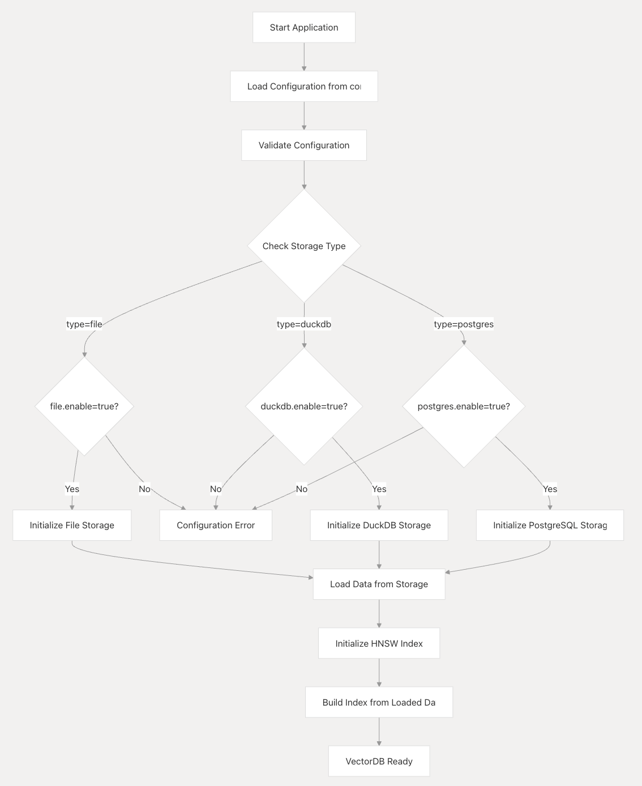

### gvdb（go vector databases）

### 一种基于golang语言实现的极简向量数据库原理实现。

#### 目标使用 YAML 配置文件指定存储类型和相关参数。

 设计默认持久化支持三种存储方式：
* Local File
* DuckDB
* PostgreSQL
* Mysql(不推荐，不作实现)

保持向量数据库的核心功能不变，适配不同存储后端。

#### 目录结构

```
gvdb/
├── config/
│   ├── config.go
│   └── config_test.go
├── storage/
│   ├── storage.go
│   ├── file.go
│   ├── file_test.go
│   ├── duckdb.go
│   ├── duckdb_test.go
│   ├── postgres.go
│   └── postgres_test.go
├── hnsw/
│   ├── hnsw.go
│   └── hnsw_test.go
├── main.go
├── go.mod
└── config.yaml
```

使用方法：

创建上述文件结构。

在项目根目录运行 go mod tidy 下载依赖。

运行 go run main.go。

注意事项

模块化后，代码按功能和存储方式清晰分离，便于独立测试和扩展。


#### 代码结构图表



#### 实现说明

* 配置文件：
每种存储方式（file、duckdb、postgres）增加了 enable 参数，布尔值。

LoadConfig 函数验证指定的 type 是否与 enable 状态一致。

* VectorDB 初始化：
NewVectorDB 根据 cfg.Storage.Type 和对应的 enable 参数选择存储后端。
如果指定的存储类型未启用或未知，会返回错误。

* 灵活性：
用户可以通过修改 config.yaml 中的 type 和 enable 参数动态切换存储方式。

* 未启用的存储方式不会初始化，即使配置了相关参数。

* 使用方法

更新 config.yaml，设置 type 和对应的 enable 参数。例如：

启用文件存储：type: "file", file.enable: true。

启用 DuckDB：type: "duckdb", duckdb.enable: true。

启用 PostgreSQL：type: "postgres", postgres.enable: true。

运行 go run main.go。

### 测试相关
运行测试
在项目根目录运行以下命令：
```
go test ./...
```

这会运行所有模块的测试。

如果需要运行特定模块的测试，例如 storage：
```
go test ./storage
```

对于 PostgreSQL 测试，需要先设置环境变量并确保 PostgreSQL 运行：
```
export POSTGRES_TEST=true
go test ./storage -run TestPostgresStorage
````

* 测试说明
Config 测试：
测试正常配置加载。

测试禁用存储类型时的错误处理。

* Storage 测试：
对每种存储（File、DuckDB、Postgres）测试增删查功能。

* PostgreSQL 测试默认跳过，需要手动启用。

* HNSW 测试：
  - 测试向量添加、搜索和删除。
  - 测试余弦相似度计算的正确性。

* 注意事项
  - 测试文件会创建临时文件（如 test_vectors.json 和 test_vectors.db），并在测试后清理。
  - PostgreSQL 测试需要运行的数据库实例，建议在 CI 或本地环境中配置。
  - 测试覆盖了主要功能，但可以根据需求添加更多边缘案例。


#### Reference Library (Thanks)
* [lib/pg](https://github.com/lib/pq)
* [gopkg.in/yaml.v2](https://gopkg.in/yaml.v2)
* [mattn/go-sqlite3](https://github.com/mattn/go-sqlite3)

### 示例使用

使用方法
手动创建 test.txt：
在 examples 目录下创建 test.txt，写入任意内容。例如：

This is a manually created test document.

文件必须存在，否则程序会报错。

运行示例：
bash

cd examples
go run text_to_vector.go

程序将读取 test.txt，生成向量，并分别测试三种存储方式。

输出示例（假设 test.txt 内容为 "This is a manually created test document."）：

Testing file storage...
Inserted test.txt with vector [40 2 3]
Search result for file storage: ID=test.txt, Similarity=1.0000, Meta=This is a manually created test document.

Testing duckdb storage...
Inserted test.txt with vector [40 2 3]
Search result for duckdb storage: ID=test.txt, Similarity=1.0000, Meta=This is a manually created test document.

Testing postgres storage...
Inserted test.txt with vector [40 2 3]
Search result for postgres storage: ID=test.txt, Similarity=1.0000, Meta=This is a manually created test document.

如果 PostgreSQL 未运行，会显示错误并跳过。

代码说明
移除文件创建：
删除了 createTestFile 函数，仅保留 processTextFile 用于读取已有文件。

test.txt 必须手动创建，程序不再生成。

保留临时文件：
移除了 defer os.Remove(testFile) 和 defer db.storage.Close()，确保 test.txt 和存储文件（如 vectors.json、vectors.db）保留。

存储支持：
File：存储在 vectors.json。

DuckDB：存储在 vectors.db。

PostgreSQL：存储在指定数据库表中。

注意事项
文件存在性：运行前必须在 examples 目录下创建 test.txt，否则会报错 "failed to read file test.txt: ..."。

PostgreSQL：需要确保数据库运行并配置正确，否则会跳过。

结果检查：运行后，可以手动检查 vectors.json、vectors.db 等文件内容。


#### 开源协议
MIT License


#### 原理小结
1. 向量化的基本概念
向量化（Vectorization）是将非结构化数据（如文本、图像、音频等）转化为固定长度的数值向量（通常是浮点数数组）的过程。这些向量能够捕捉数据的语义或特征，使得计算机可以通过数学运算（如距离计算）来比较和处理这些数据。在你的代码中，向量化是将文本内容转化为一个三维向量 [float64(len(text)), 2.0, 3.0]。
为什么需要向量化？
语义表示：向量可以表示数据的含义或特征，例如文本的主题或语义。

数学运算：向量允许使用距离度量（如余弦相似度）来比较相似性。

高效存储和检索：向量数据库（如你的实现）利用向量的高效索引（如 HNSW）来加速搜索。

2. 代码中的向量化实现
在 examples/text_to_vector.go 中，向量化由 MockEmbeddingModel 的 GenerateEmbedding 方法实现：
go

func (m *MockEmbeddingModel) GenerateEmbedding(text string) []float64 {
    return []float64{float64(len(text)), 2.0, 3.0}
}

原理解读
输入：文本字符串，例如 "This is a manually created test document."。

处理：计算文本的长度（字符数），并构造一个三维向量：
第一维：float64(len(text))，即文本长度（例如 40）。

第二维：固定值 2.0。

第三维：固定值 3.0。

输出：一个三维向量，例如 [40.0, 2.0, 3.0]。

特点
简单性：这是一个模拟实现，仅基于文本长度生成向量，不考虑文本的具体内容或语义。

局限性：
无法捕捉语义：不同内容但长度相同的文本会得到相同向量。

固定维度：始终输出三维向量，缺乏灵活性。

目的：用于测试向量数据库的存储和搜索功能，而非真实语义表示。

3. 真实场景中的向量化原理
在实际应用中，向量化通常依赖自然语言处理（NLP）模型，特别是深度学习模型（如 Transformer），以生成语义丰富的向量。以下是常见的向量化原理：
3.1 词袋模型（Bag of Words, BoW）
原理：统计文本中每个单词的出现频率，生成一个稀疏向量。

示例：
文本："This is a test"

词汇表：{this: 0, is: 1, a: 2, test: 3}

向量：[1, 1, 1, 1]（表示每个词出现一次）

局限性：忽略词序和语义。

3.2 TF-IDF（词频-逆文档频率）
原理：在词袋模型基础上，引入词的重要性权重（TF 表示词频，IDF 表示逆文档频率），生成加权向量。

示例："This is a test" 可能生成 [0.3, 0.3, 0.5, 0.7]。

特点：考虑词的稀有性，但仍缺乏语义理解。

3.3 Word2Vec / GloVe
原理：使用神经网络训练词嵌入（Word Embeddings），将每个词映射到一个固定维度的密集向量，捕捉词的语义关系。

示例：
"king" -> [0.1, 0.5, -0.2, ...]

"queen" -> [0.12, 0.48, -0.18, ...]（与 "king" 相似）

处理文本：对句子取词向量的平均值或加权和。

特点：捕捉词级语义，但对长文本效果有限。

3.4 Transformer 模型（BERT、Sentence-BERT 等）
原理：
使用预训练的 Transformer 模型，将整个句子或段落编码为一个固定长度的向量。

通过注意力机制（Attention）捕捉词与词之间的上下文关系。

示例：
文本："This is a test document"

输出：一个 768 维向量（假设使用 BERT），如 [0.12, -0.34, 0.56, ...]。

特点：
语义丰富：相同意思的不同表达会有相似的向量。

计算复杂：需要调用模型（如通过 API 或本地推理）。
